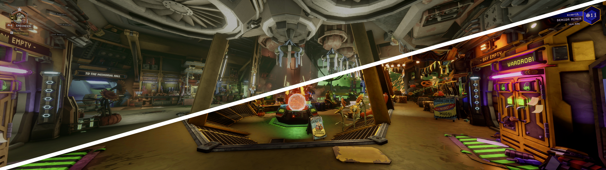

# HDR2SDR-LUTs
What is this: Some LUTs (Look Up Tables) to convert HDR screenshots to reasonable SDR levels.

Before / After

Thease simply compress the levels and increase the saturation. Since the dynamic range is not always the same I created some different presets, just try out which one fits your needs the most.
